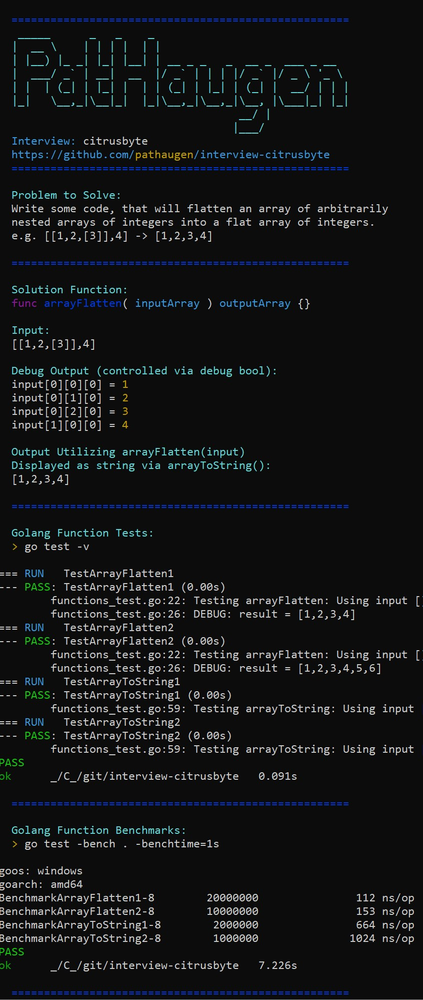

interview-citrusbyte
====================

interview-citrusbyte: citrusbyte interview question expanded to a public repo.

Features:
* [x] Golang utilized for single binary without dependencies
* [x] Console Application
* [x] Console color support
* [x] Application splash logo
* [x] Testing framework
* [x] Benchmarking framework

Installation and Running (from a directory of your choice):
* > $ git clone https://github.com/pathaugen/interview-citrusbyte
* > $ go test
* > $ go build
* > $ interview-citrusbyte.exe

Related Links:
* https://github.com/pathaugen/
* https://circleci.com/gh/pathaugen/
* https://travis-ci.com/pathaugen/
* https://www.linkedin.com/in/patrickhaugen/
